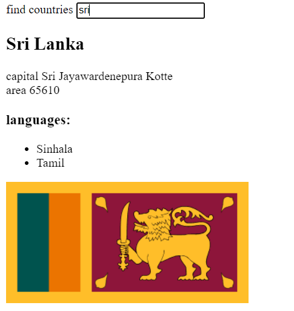

# Data for countries

This application provides a minimal setup to view information from different countries and also get current wether data of relevent Capital from [openweathermap](https://openweathermap.org/) and show it 

eg:-

